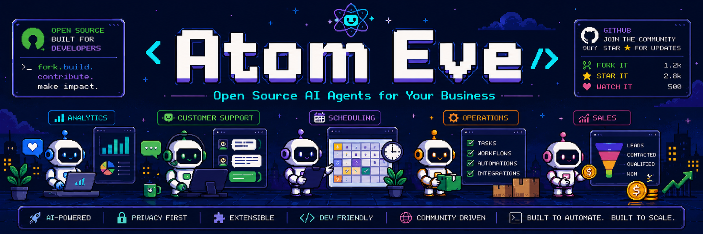

# Atom Eve


**Installable AI agents for Eve projects.**

Atom Eve is an open-source, shadcn-style registry of real agent source code. Browse an agent, install it into your own repo, add your credentials, and run it on [Eve](https://eve.dev).

```bash
npx atom-eve add facebook-ads
```

The registry is source-first. Atom Eve does not host or run your agents, store credentials, or provide a managed runtime. It gives you code you can review, copy, modify, and deploy yourself.

> Atom Eve is a community project. It is not affiliated with or endorsed by Vercel, Eve, or Cloudflare.

## Get Started With An AI Coding Agent

The fastest way to start — especially if you've never used Eve — is to let your coding
agent set it up. Paste this into **Claude Code**, **Codex**, **Cursor**, or similar:

```text
Set up a new Eve project in this directory using Atom Eve.
Read https://raw.githubusercontent.com/elie222/atom-eve/main/USAGE.md and follow it.
Start with one agent so we can confirm it builds and runs, then we'll add more.
```

The agent fetches [`USAGE.md`](USAGE.md), scaffolds the project, installs an agent, and verifies the
build — you don't need to read the rest of this README first. Name specific agents (browse
[atomeve.dev](https://atomeve.dev)) if you already know what you want.

Prefer to drive it yourself? Keep reading, or jump to [`USAGE.md`](USAGE.md) for the manual steps.

## Why This Exists

Skills and prompts are useful, but they usually run only when a human invokes them. Production agents need structure: instructions, tools, skills, schedules, credentials, evals, deployment shape, and framework-specific entrypoints.

Atom Eve packages that structure into installable agent folders:

- **Eve agents** install as root agents under `agent/`.
- Shared instructions, skills, and library code live once in this repo.
- Generated shadcn registry files make installs transparent and inspectable.

## Browse The Registry

The website is the human-facing catalog:

- [atomeve.dev](https://atomeve.dev)
- [Full generated registry index](https://atomeve.dev/index.json)

Each agent page links back to its source folder and renders that agent's README.

## Install An Agent

Scaffold a full app and install an agent in one step (`create` delegates to the framework's own
scaffolder, then installs the agent's source):

```bash
npx atom-eve create my-agent --target eve --agent facebook-ads
cd my-agent
```

On Eve this is **Vercel-native**: run `vercel link` and the model resolves through the Vercel AI
Gateway via `VERCEL_OIDC_TOKEN` — no model API key to set. Per-agent integration secrets (e.g.
`STRIPE_SECRET_KEY`) are Vercel project env vars. See [`USAGE.md`](USAGE.md) for the full flow.

Adding an agent to an existing project instead:

```bash
npx atom-eve add facebook-ads --target eve
```

If the current directory does not have a `package.json` yet, `add` initializes the Atom Eve project
files first and then installs the agent.

Add Slack as an Eve interface when you install:

```bash
npx atom-eve add seo-audit --target eve --channel slack
npx atom-eve add seo-audit --target eve --deliver slack
```

`--channel slack` installs a bidirectional Slack channel. `--deliver slack` implies the channel and rewires simple scheduled report prompts so the scheduled run posts its final answer to `SLACK_CHANNEL_ID`.

Running many agents from one repo? Scaffold a workspace root and create one app per agent:

```bash
npx atom-eve init --workspace my-agents
cd my-agents
npx atom-eve create facebook-ads --target eve --agent facebook-ads
```



The CLI writes `atom-eve.json` to remember project defaults. When it can safely detect your project, it uses that. When it cannot, it asks for `--target eve`.

### Local Checkout Fallback

If you are developing the registry locally or need to bypass the public GitHub source, install from a checkout path:

```bash
npx atom-eve add /path/to/atom-eve/registry/facebook-ads --target eve
```

This uses the same install map as public registry installs, but reads the source files directly from disk.

## Eve Is New

The framework is early and moving quickly.

- [Eve](https://eve.dev) is Vercel's agent framework. Eve projects have an `agent/` authored surface with slots for instructions, tools, skills, connections, schedules, and subagents.

Expect some framework APIs and conventions to change. This repo keeps fixture installs and typechecks in CI so generated agents stay honest as the ecosystem moves.

### Running Many Eve Agents On Vercel

Today Eve treats `agent/` as one root agent per deployed app. Subagents are useful for delegation, but they are not independent deployed agents: channels and schedules are root-only. If you want many standalone Eve agents with their own Slack connectors, cron jobs, env vars, logs, and deployment lifecycle, use one repository with one Eve app folder per agent and create one Vercel project for each app.

Recommended shape:

```text
my-agents/
  agents/
    website-qa/          # Vercel project: website-qa
      agent/
      package.json
    seo/                 # Vercel project: seo
      agent/
      package.json
    youtube-analytics/   # Vercel project: youtube-analytics
      agent/
      package.json
```

Install Atom Eve packages into the app folder for the agent you are deploying. This keeps each production agent isolated while still letting your team manage a private agent catalog in one GitHub repo.

## Add Your Own Agent

Create a folder under `registry/`:

```text
registry/my-agent/
  atom.json
  README.md
  shared/
    instructions.md
    skills/
    lib/
  targets/
    eve/
```

Minimum requirements:

- Globally unique `name` in `atom.json`.
- An `eve` target.
- README with setup and usage instructions.
- Real source code, not placeholder logic.
- No secrets committed to the repo.
- `pnpm check` passes.

The generator validates manifests, taxonomy, required README sections, generated registry files, and fixture installs.

`atom.json` is intentionally small. Runtime behavior belongs in files:

```json
{
  "$schema": "https://atomeve.dev/schema/atom.json",
  "name": "facebook-ads",
  "title": "Facebook Ads Agent",
  "description": "Reviews campaign performance and proposes daily budget and creative actions.",
  "category": "ads",
  "family": "growth",
  "targets": ["eve"],
  "integrations": ["facebook-ads"],
  "connections": [{ "name": "facebook-ads", "type": "custom-tool", "auth": "env" }],
  "requiredEnv": ["FB_ACCESS_TOKEN", "FB_AD_ACCOUNT_ID"]
}
```

Source paths are inferred:

- `shared/instructions.md` becomes Eve instructions and shared prompt source.
- `shared/skills/*` installs as framework-native skill files.
- `shared/lib/*` installs into target-specific library paths.
- `targets/eve/agent.ts` is the Eve root-agent entrypoint.
- `targets/eve/schedules/*` installs as Eve root schedules.

For example, cron timing belongs in `targets/eve/schedules/daily.ts` or the target-specific scheduling/workflow file, not in `atom.json`.

## Repository Layout

```text
apps/
  web/                    # Static generated catalog
packages/
  cli/                    # atom-eve CLI
  registry-generator/     # atom.json -> shadcn registry + site index
  schemas/                # Shared schemas
registry/
  facebook-ads/           # Reference agent package
fixtures/
  eve/                    # Minimal install/typecheck fixture
public/
  r/                      # Ignored generated shadcn registry item payloads
  index.json              # Ignored generated website/catalog index
```

## Development

```bash
pnpm install
pnpm generate
pnpm typecheck
pnpm build
pnpm verify:fixtures
pnpm check
```

`pnpm check` runs generation, package typechecks, builds, fixture installs/typechecks, and a basic secret scan.

## License

MIT
